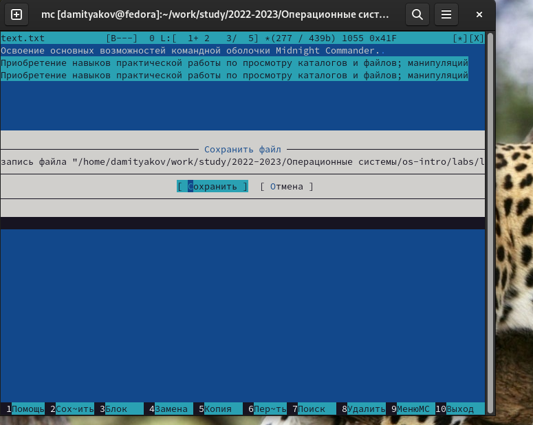

---
## Front matter
title: "Отчёт по лабораторной работе №9"
author: "Дмитрий Алексеевич Митяков"

## Generic otions
lang: ru-RU
toc-title: "Содержание"

## Bibliography
bibliography: bib/cite.bib
csl: pandoc/csl/gost-r-7-0-5-2008-numeric.csl

## Pdf output format
toc: true # Table of contents
toc-depth: 2
lof: true # List of figures
lot: true # List of tables
fontsize: 12pt
linestretch: 1.5
papersize: a4
documentclass: scrreprt
## I18n polyglossia
polyglossia-lang:
  name: russian
  options:
	- spelling=modern
	- babelshorthands=true
polyglossia-otherlangs:
  name: english
## I18n babel
babel-lang: russian
babel-otherlangs: english
## Fonts
mainfont: PT Serif
romanfont: PT Serif
sansfont: PT Sans
monofont: PT Mono
mainfontoptions: Ligatures=TeX
romanfontoptions: Ligatures=TeX
sansfontoptions: Ligatures=TeX,Scale=MatchLowercase
monofontoptions: Scale=MatchLowercase,Scale=0.9
## Biblatex
biblatex: true
biblio-style: "gost-numeric"
biblatexoptions:
  - parentracker=true
  - backend=biber
  - hyperref=auto
  - language=auto
  - autolang=other*
  - citestyle=gost-numeric
## Pandoc-crossref LaTeX customization
figureTitle: "Рис."
tableTitle: "Таблица"
listingTitle: "Листинг"
lofTitle: "Список иллюстраций"
lotTitle: "Список таблиц"
lolTitle: "Листинги"
## Misc options
indent: true
header-includes:
  - \usepackage{indentfirst}
  - \usepackage{float} # keep figures where there are in the text
  - \floatplacement{figure}{H} # keep figures where there are in the text
---

# Цель работы

Освоение основных возможностей командной оболочки Midnight Commander. Приобретение навыков практической работы по просмотру каталогов и файлов; манипуляций
с ними.

# Выполнение лабораторной работы

Изучаю информацию о mc, вызвав в командной строке man mc.
(рис. @fig:001).
{#fig:001 width=70%}

(рис. @fig:002).
{#fig:002 width=70%}

Запускаю из командной строки mc
(рис. @fig:003).
{#fig:003 width=70%}

Выполняю различные операции в mc используя управляющие клавиши:
-Копирование
(рис. @fig:004).
{#fig:004 width=70%}

-Перемещение
(рис. @fig:005).
{#fig:005 width=70%}

-Фильтр
(рис. @fig:006).
{#fig:006 width=70%}

-Информация
(рис. @fig:007).
{#fig:007 width=70%}

С помощью Файл открываю для чтения файл
(рис. @fig:008).
{#fig:008 width=70%}

(рис. @fig:009).
{#fig:009 width=70%}

И также для редактирования
(рис. @fig:010).
1{#fig:010 width=70%}

Создаю новый каталог
(рис. @fig:011).
{#fig:011 width=70%}

Меню Файл
(рис. @fig:012).
{#fig:012 width=70%}

Меню Команда
(рис. @fig:013).
{#fig:013 width=70%}

Поиск файла
(рис. @fig:014).
{#fig:014 width=70%}

Дерево каталогов
(рис. @fig:015).
{#fig:015 width=70%}

Меню Настройки
(рис. @fig:016).
{#fig:016 width=70%}

Создал файл 'text.txt'
(рис. @fig:017).
{#fig:017 width=70%}

Скопировал в него текст
(рис. @fig:018).
{#fig:018 width=70%}

Перенос и копирование строки
(рис. @fig:021).
{#fig:021 width=70%}

Сохранение файла
(рис. @fig:022).
{#fig:022 width=70%}
Отмена действия Ctrl+U
Переход в конец Ctrl+X
(рис. @fig:023).
{#fig:023 width=70%}

Переход в начало Ctrl+Z
(рис. @fig:024).
{#fig:024 width=70%}

(рис. @fig:025).
{#fig:025 width=70%}

# Выводы

Я освоил основные возможности командной оболочки Midnight Commander. Приобретел навыки практической работы по просмотру каталогов и файлов; манипуляций
с ними.

# Контрольные вопросы

1. Какие режимы работы есть в mc. Охарактеризуйте их.
-Есть два режима - Информация (выводятся сведения о файле и системе) и Дерево (выводится структура дерева каталогов)
2. Какие операции с файлами можно выполнить как с помощью команд shell, так и с помощью меню (комбинаций клавиш) mc? Приведите несколько примеров.
-Большая часть команд у них похожие, например, копирование, перемещение и создание
3. Опишите структура меню левой (или правой) панели mc, дайте характеристику командам.
-В этом меню команды отображения и структуры каталогов, такие как: Список файлов, Быстрый просмотр, Информация, Дерево, Формат списка, Порядок сортировки, Фильтр, Выбор кодировки и Соединения. Эти команды позволяют отображать нужные файлы, например фильтр или файлы в каком-то порядке, например порядок сортировки.
4. Опишите структура меню Файл mc, дайте характеристику командам.
-Здесь содержаться команды разной информации, изменения файлов и просмотра. Просмотр, Просмотр файла, Просмотр вывода команды, Правка, Копирование, Права доступа, Жесткая ссылка, Символьная ссылка, Относительная символьная ссылка, Правка ссылки, Владелец/группа, Правда(расширенные), Изменение атрибутов, Переименование, Создание каталога, УДалить, Смена каталога, Отметить группу, Снять отметку, Обратить выделение.
5. Опишите структура меню Команда mc, дайте характеристику командам.
-Здесь команды устройства командера и взаимодействия с каталогами и файлами. Меню пользователя, Дерево каталогов, Поиск файла, Переставить панели, Отключить панели, Сравнить каталоги, Сравнить файлы, Внешняя панелизация, Размеры каталогов, История командной строки, История просмотра/правки файлов, Каталоги быстрого доступа, Список активных ВФС, Фоновые задания, Список экранов, Править файл расширений, Править файл меню, Править  файл расцветки имен.
6. Опишите структура меню Настройки mc, дайте характеристику командам.
-Настройки внешнего вида, взаимодействия с командером. Конфигурация, Внешний вид, Настройки панелей, Подтверждение, Оформление, Биты символов, Определение клавиш, Виртуальные ФС, Сохранить настройки.
7. Назовите и дайте характеристику встроенным командам mc.
-В командную оболочку mc встроены стандартные команды, например вызов встроенного редактора, просмотр файлов, Перенос файлов из одной панели в другую, Удаление файлов, Создание каталога, Выход.
8. Назовите и дайте характеристику командам встроенного редактора mc.
- Ctrl+y удалить строку. Ctrl+u отмена последней операции. Ins вставка/замена. F7 поиск. Shift+F7 повтор последней операции поиска. F4 замена файла. F3 первое нажатие начало выделения, второе это окончание выделения. F5 копировать выделенный фрагмент F6 переместить выделенный фрагмент. F8 удалить выделенный фрагмент. F2 записать изменения в файл. F10 выйти из редактора.
9. Дайте характеристику средствам mc, которые позволяют создавать меню, определяемые пользователем.
-Один из четырех форматов списка в Midnight Commander -Пользовательский определённый самим пользователем позволяет ему редактировать меню любого из двух списков. А меню пользователя – это меню, состоящее из команд, определенных пользователем. 

# Список литературы{.unnumbered}

::: {#refs}
:::
