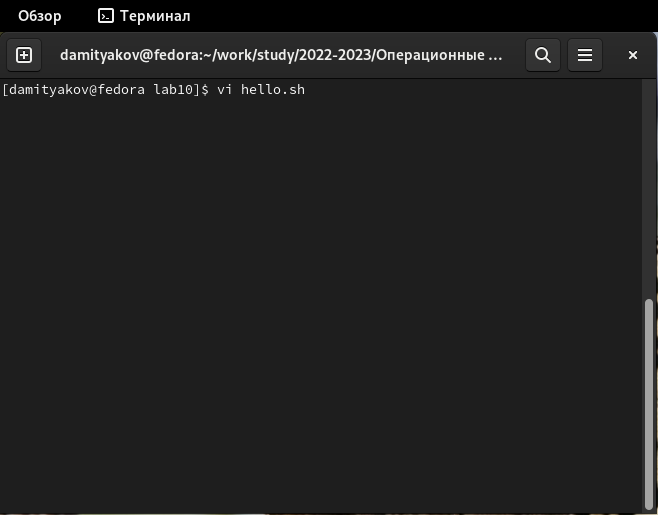
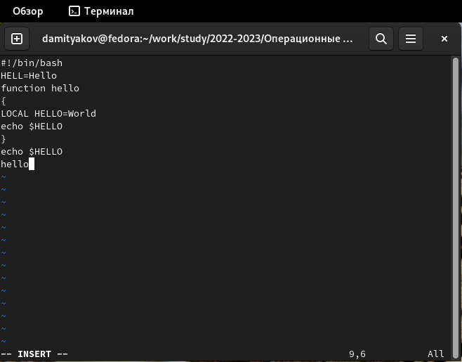
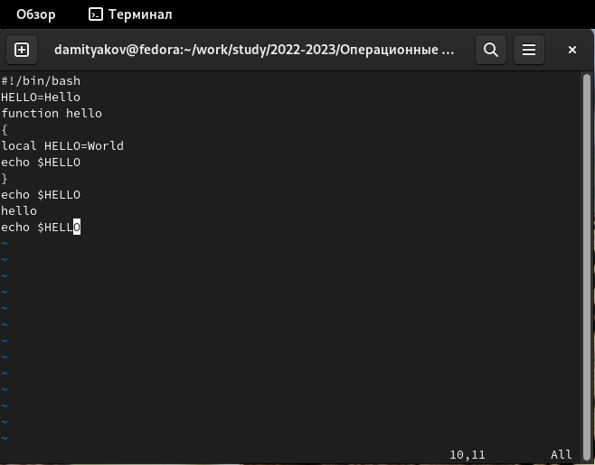

---
## Front matter
title: "Отчёт по лабораторной работе №10"
author: "Дмитрий Алексеевич Митяков"

## Generic otions
lang: ru-RU
toc-title: "Содержание"

## Bibliography
bibliography: bib/cite.bib
csl: pandoc/csl/gost-r-7-0-5-2008-numeric.csl

## Pdf output format
toc: true # Table of contents
toc-depth: 2
lof: true # List of figures
lot: true # List of tables
fontsize: 12pt
linestretch: 1.5
papersize: a4
documentclass: scrreprt
## I18n polyglossia
polyglossia-lang:
  name: russian
  options:
	- spelling=modern
	- babelshorthands=true
polyglossia-otherlangs:
  name: english
## I18n babel
babel-lang: russian
babel-otherlangs: english
## Fonts
mainfont: PT Serif
romanfont: PT Serif
sansfont: PT Sans
monofont: PT Mono
mainfontoptions: Ligatures=TeX
romanfontoptions: Ligatures=TeX
sansfontoptions: Ligatures=TeX,Scale=MatchLowercase
monofontoptions: Scale=MatchLowercase,Scale=0.9
## Biblatex
biblatex: true
biblio-style: "gost-numeric"
biblatexoptions:
  - parentracker=true
  - backend=biber
  - hyperref=auto
  - language=auto
  - autolang=other*
  - citestyle=gost-numeric
## Pandoc-crossref LaTeX customization
figureTitle: "Рис."
tableTitle: "Таблица"
listingTitle: "Листинг"
lofTitle: "Список иллюстраций"
lotTitle: "Список таблиц"
lolTitle: "Листинги"
## Misc options
indent: true
header-includes:
  - \usepackage{indentfirst}
  - \usepackage{float} # keep figures where there are in the text
  - \floatplacement{figure}{H} # keep figures where there are in the text
---

# Цель работы

Познакомиться с операционной системой Linux. Получить практические навыки работы с редактором vi, установленным по умолчанию практически во всех дистрибутивах.

# Выполнение лабораторной работы
Создадим и перейдем в каталог с именем ~/work/os/lab10
Вызовем vi и создадим файл hello.sh vi hello.sh
(рис. @fig:001).
{#fig:001 width=70%}

Нажмем клавишу 'i' и введем текст задания
(рис. @fig:002).
{#fig:002 width=70%}
Нажмем esc и : для перехода в командный режим и перехода в режим послежней строки
(рис. @fig:003).
{#fig:003 width=70%}
Нажмем w - записать и q - выйти
Вызовем vi для редактирования файла и изменим его согласно инструкции
(рис. @fig:004).
{#fig:004 width=70%}
Последнее действие можно отменить с помощью :u 
(рис. @fig:005).
{#fig:005 width=70%}
Создадим исполняемый файл и исполним его, всё работает
(рис. @fig:006).
{#fig:006 width=70%}
(рис. @fig:007).

# Выводы

В ходе роботы я познакомился с операционной системой Linux, и получил практические навыки работы с редактором vi, установленным по умолчанию практически во всех дистрибутивах UNIX. А также освоил основные режимы и команды

# Контрольные вопросы

1. Дайте краткую характеристику режимам работы редактора vi.
- В редакторе есть три режима работы: командный, вставки и последней(командной) строки. Командный предназначен для навигации и ввода команд редактирования, режим вставки для ввода текста в файл, режим командной строки для использования команд, например: отмена предыдущего действия, сохранение файла, выход из файла и т.д.
2. Как выйти из редактора, не сохраняя произведённые изменения?
-перейти в режим командной строки и ввести :q
3. Назовите и дайте краткую характеристику командам позиционирования.
-0 - переход в начало строки
$ - переход в конец строки
G - переход в конец файла
n G - переход в строку с номером n
4. Что для редактора vi является словом?
-строка символов (буквы, цифры, символы подчеркивания)
5. Каким образом из любого места редактируемого файла перейти в начало (конец)
файла?
-G - переход в конец файла, 1 G - переход в начало файла
6. Назовите и дайте краткую характеристику основным группам команд редактирования.
-Команды редактирования имеют девять командных блока: Вставка текста, вставка строки, удаление текста, текстовой редактор vi, отмена и повтор произведённых изменений, копирование текста в буфер, вставка текста из буфера, замена текста, поиск текста, a) Вставка текста – а — вставить текст после курсора; – А — вставить текст в конец строки; – i — вставить текст перед курсором; – n i — вставить текст n раз; – I — вставить текст в начало строки. b) Вставка строки – о — вставить строку под курсором; – О — вставить строку над курсором. с) Удаление текста – x — удалить один символ в буфер; – d w — удалить одно слово в буфер; – d $ — удалить в буфер текст от курсора до конца строки; – d 0 — удалить в буфер текст от начала строки до позиции курсора; d) Текстовой редактор vi – d d — удалить в буфер одну строку; – n d d — удалить в буфер n строк. e) Отмена и повтор произведённых изменений – u — отменить последнее изменение; – . — повторить последнее изменение. f) Копирование текста в буфер – Y — скопировать строку в буфер; – n Y — скопировать n строк в буфер; – y w — скопировать слово в буфер. g) Вставка текста из буфера – p — вставить текст из буфера после курсора; – P — вставить текст из буфера перед курсором. h) Замена текста – c w — заменить слово; – n c w — заменить n слов; – c $ — заменить текст от курсора до конца строки; – r — заменить слово; – R — заменить текст. i) Поиск текста – / текст — произвести поиск вперёд по тексту указанной строки символов текст; – ? текст — произвести поиск назад по тексту указанной строки символов текст.
7. Необходимо заполнить строку символами $. Каковы ваши действия?
- full $
8. Как отменить некорректное действие, связанное с процессом редактирования?
- В командной строке ввести команду :u
9. Назовите и дайте характеристику основным группам команд режима последней строки.
- Копирование и перемещение текста – : n,m d — удалить строки с n по m; – : i,j m k — переместить строки с i по j, начиная со строки k; – : i,j t k — копировать строки с i по j в строку k; – : i,j w имя-файла — записать строки с i по j в файл с именем имя-файла.
Запись в файл и выход из редактора – : w — записать изменённый текст в файл, не выходя из vi; – : w имя-файла — записать изменённый текст в новый файл с именем имя- файла; – : w ! имя-файла — записать изменённый текст в файл с именем имя- файла; – : w q — записать изменения в файл и выйти из vi; – : q — выйти из редактора vi; – : q ! — выйти из редактора без записи; – : e ! — вернуться в командный режим, отменив все изменения, произве- дённые со времени последней записи
Опции Опции редактора vi позволяют настроить рабочую среду. Для задания опций используется команда set (в режиме последней строки): – : set all — вывести полный список опций; – : set nu — вывести номера строк; – : set list — вывести невидимые символы; – : set ic — не учитывать при поиске, является ли символ прописным или строчным.
10. Как определить, не перемещая курсора, позицию, в которой заканчивается строка?
- Ввести команду full и символ. После этого вся строка заполнится этим символом, а курсор останется на месте.
11. Выполните анализ опций редактора vi (сколько их, как узнать их назначение и т.д.).
- Опции редактора vi позволяют настроить рабочую среду. Для задания опций используется команда set (в режиме последней строки): – : set all — вывести полный список опций; – : set nu — вывести номера строк; – : set list — вывести невидимые символы; – : set ic — не учитывать при поиске, является ли символ прописным или строчным. Если мы хотим узнать назначение опций, мы должны ввести в консоли man vi set.
12. Как определить режим работы редактора vi?
-  Если внизу написано "Insert" - значит это режим вставки, если внизу есть двоеточие - это режим командной строки, если надписей нет - это комнадный режим
13. Постройте граф взаимосвязи режимов работы редактора vi.
- Переход осуществляется из A в B при помощи I и ESC обратно.
Переход осуществляется из A в C при помощи : и ESC обратно.
Переход осуществляется из A в D при помощи ? или / и ESC обратно.
Переход осуществляется из A в E при помощи v и ESC обратно. a) командный режим b) режим вставки c) режим строки d) Режим поиска e) Визуальный режим

# Список литературы{.unnumbered}

::: {#refs}
:::
